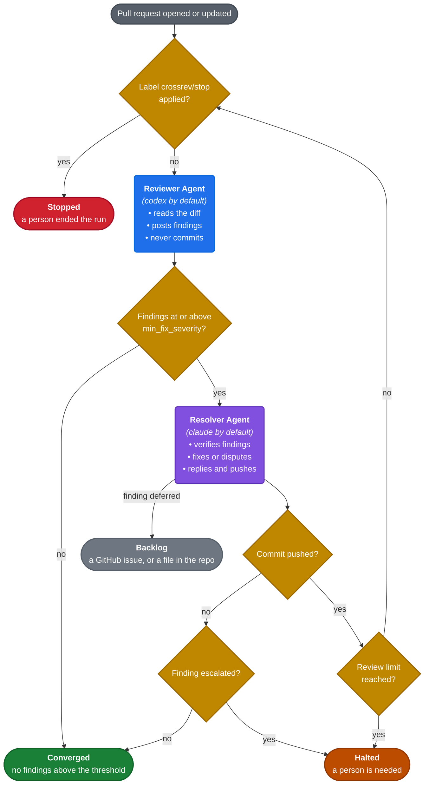

# CrossRev

[](https://www.npmjs.com/package/crossrev-ai)
[](https://github.com/carlosboeing/crossrev/actions/workflows/ci.yml)
[](LICENSE)
[](docs/installation.md)
[](docs/ROADMAP.md)

**CrossRev is a cross-model pull request (PR) review and resolution loop.** It coordinates independent reviewer and resolver agents around a pull request. The reviewer agent examines the changes and posts findings as inline PR comments. The resolver agent verifies each finding, fixes valid defects, and disputes false positives. The reviewer agent then inspects the resulting revision, and the loop continues until it converges, reaches a configured limit, or needs a person.

Agents can be configured with different harnesses, models, and effort levels. Configured harnesses authenticate through existing AI subscriptions or provider API keys.

CrossRev reviews a selected PR on demand from the CLI or starts review cycles automatically through GitHub Actions.

## Features

| Capability | What CrossRev does |
|---|---|
| Review and resolution | Reviews a change, verifies every finding, applies valid fixes, records disagreements, and reviews the new revision |
| Agent configuration | Configures the reviewer and resolver agents independently by harness, model, and effort level |
| Model access | Supports AI subscriptions, provider API keys, and compatible endpoints for cloud-hosted or self-hosted models |
| Local and automated operation | Reviews a selected PR from the CLI or responds to GitHub events through GitHub Actions |
| Pull-request state | Records every pass in comments and labels, with no database or local state file |
| Credential separation | Keeps GitHub credentials in the orchestrator and out of the model process |

## Quick start

### Requirements

CrossRev currently supports macOS and Linux. It requires `git`, authenticated `gh`, `jq`, `yq`, `openssl`, and at least one supported agent CLI; the `npx` and npm routes also require Node.js. The **default configuration** uses Codex for the reviewer agent and Claude for the resolver agent, but you can choose different [harnesses](#harness-support) and [models](#configuration).

### Run without installing

Run one review pass directly from npm:

```bash
npx crossrev-ai review --pr 42
```

The review command posts inline comments and a summary, but **never edits or pushes the branch**. CrossRev uses your existing `gh` authentication, so the comments appear under your GitHub account.

### Install CrossRev

The bootstrap installer creates a checkout and installs the complete command set, including automated-mode setup:

```bash
curl -fsSL https://raw.githubusercontent.com/carlosboeing/crossrev/main/bootstrap.sh | bash
```

Install the local CLI globally through npm:

```bash
npm install -g crossrev-ai
```

An npm installation supports local commands. `crossrev init` requires a checkout because it reads the Git commit used to pin generated workflows.

From an existing checkout, run:

```bash
./install.sh
```

See [Installing CrossRev](docs/installation.md) for pinned revisions, custom installation directories, updates, and removal.

### Review a pull request

Check the machine, then run one review pass:

```bash
crossrev doctor
crossrev review --pr 42
```

Run the complete review and resolution cycle when you are ready for CrossRev to apply fixes:

```bash
crossrev cycle --pr 42
```

> [!WARNING]
> `crossrev cycle` and `crossrev resolve` can commit and push to the pull request branch.

## Review loop



A **cycle** contains one or more **passes**. In each pass, the reviewer agent examines the current revision. The resolver agent follows when findings meet the configured severity threshold. The loop ends when it converges, reaches a limit, or needs a person.

The review limit is `policy.max_passes_per_cycle`, which defaults to 3. [Using CrossRev](docs/usage.md) documents all six termination conditions and their precedence.

Every finding receives one resolution:

| Resolution | Meaning |
|---|---|
| `fixed` | The resolver agent changed the code |
| `disputed` | The finding is incorrect for this codebase, with the reason recorded in the review thread |
| `deferred` | The finding is valid but belongs in the configured backlog |
| `skipped` | Policy excludes the finding from changes, usually because it is below `min_fix_severity` |
| `escalated` | A person must decide, so CrossRev applies `crossrev/stop` and leaves the thread open |

## Configuration

CrossRev needs no configuration for local use. The defaults use Codex as the reviewer agent and Claude as the resolver agent.

To configure a repository:

1. Create `.github/crossrev.yml`, or let `crossrev init` generate it for automated mode.
2. Configure the reviewer agent, resolver agent, and policy.
3. Keep machine-specific endpoints in `~/.config/crossrev/config.yml`.

The following example uses two Claude models in local mode:

```yaml
version: 1
mode: local

policy:
  min_fix_severity: medium
  max_passes_per_cycle: 3

reviewer:
  harness: claude
  model: claude-fable-5
  effort: medium

resolver:
  harness: claude
  model: claude-opus-5
  effort: high
```

`harness` names the agent CLI. `model` and `effort` pass through to that harness. The reviewer and resolver configurations must differ by harness, model, or endpoint.

Compatible endpoints extend CrossRev beyond a harness's default provider. CrossRev supports public providers such as Kimi, self-hosted models through Ollama, and LLM gateways such as LiteLLM. See the [operator configuration template](templates/operator-config.yml) for endpoint examples.

Override a harness for one command without changing repository policy:

```bash
crossrev review --pr 42 --harness claude
```

**CrossRev reads repository policy from the pull request's base revision.** A branch under review cannot change the rules used to review itself. See [Configuring CrossRev](docs/configuration.md) for every field and merge rule.

## Local and automated modes

CrossRev uses the same agents and protocol in both modes. The trigger and trusted GitHub identity change:

| | Local | Automated |
|---|---|---|
| Trigger | A terminal command | Pull request events and CrossRev labels |
| GitHub identity | Your authenticated `gh` account | A repository-scoped GitHub App |
| Setup | Install CrossRev and its dependencies | Run `crossrev auth login`, then `crossrev init` |
| State | Pull request comments and labels | Pull request comments and labels |
| Runner | Your machine | GitHub-hosted or self-hosted |

> [!CAUTION]
> CrossRev **supports self-hosted runners**, but public repositories require stricter isolation. Public PRs can carry prompt injections that expose credentials or change files used by later jobs. GitHub warns that self-hosted runners can be persistently compromised and should generally not be used for public repositories in its [secure-use guidance](https://docs.github.com/en/actions/reference/security/secure-use#hardening-for-self-hosted-runners). For public repositories, use a **GitHub-hosted runner** or a fresh, [ephemeral self-hosted runner](https://docs.github.com/en/actions/reference/runners/self-hosted-runners#ephemeral-runners-for-autoscaling) that handles one job and is destroyed afterward. A container alone is not sufficient if it can reach host credentials or shared state.

Automated mode starts with two commands. The second prints every file, secret, and label it would change before asking for confirmation:

```bash
crossrev auth login
crossrev init
```

Automated mode reviews branches in the repository, including Dependabot branches. It refuses fork pull requests because GitHub withholds repository secrets from fork workflows. Local review supports forks, and local resolution supports them when maintainer edits are enabled.

## Harness support

CrossRev has adapters for Claude Code, Codex, Antigravity, and Grok. Kimi runs through the Claude adapter as a named endpoint.

Whether a harness works in GitHub Actions depends on its credential lifetime and the selected runner:

<!-- crossrev:harness-table:start -->
<!-- Generated by scripts/render-harness-docs.sh — do not edit -->
| Harness | Subscription credential | Lifetime | Survives an ephemeral runner |
|---|---|---|---|
| `claude` | `claude setup-token`, purpose-built | 1 year | Yes |
| `codex` | OAuth access token in `~/.codex/auth.json` | 10 days | Yes, with the refresher below |
| `agy` | the OS keyring on macOS (`Antigravity Safe Storage`); `~/.gemini/antigravity-cli/antigravity-oauth-token` on a host with no D-Bus session bus | 56 minutes | No, CrossRev cannot seed into a hosted runner yet |
| `grok` | `~/.grok/auth.json` | 6 hours | Yes, by self-refreshing |
| `kimi` | OAuth access token | 15 minutes | No |
<!-- crossrev:harness-table:end -->

`crossrev init` refuses a pairing that its runner cannot serve. A self-hosted runner uses its installed logins and supports every pairing. [CrossRev credentials](docs/credentials.md) explains the hosted-runner requirements and the Codex refresher.

## Commands

| Command | Effect |
|---|---|
| `crossrev --pr 42` | Runs the complete cycle, the same as `crossrev cycle --pr 42` |
| `crossrev review --pr 42` | Runs one review pass and posts comments without changing the branch |
| `crossrev resolve --pr 42` | Verifies the latest findings, then may commit and push fixes |
| `crossrev status --pr 42` | Shows the current state, every pass, and the command that resumes the loop |
| `crossrev watchdog --repo owner/name` | Finds stalled automated work, retries once, then halts it for inspection |
| `crossrev doctor` | Checks dependencies, GitHub authentication, installed harnesses, and runner compatibility |
| `crossrev init` | Plans and installs automated mode after confirmation |

## Safety and limits

`crossrev review` writes comments but never changes the branch. `crossrev resolve` and `crossrev cycle` may commit and push fixes.

CrossRev checks every push target before anything leaves the machine. The target must be the pull request's head branch, not the default branch, and its repository must match the configured remote.

The loop enforces the configured severity threshold and pass limit. CrossRev checks the `crossrev/stop` label before starting each agent. The label prevents the next agent from starting but does not cancel one already in progress.

CrossRev **supports self-hosted runners**, but public repositories require stricter isolation. Public PRs can carry prompt injections that expose credentials or change files used by later jobs. GitHub warns that self-hosted runners can be persistently compromised and should generally not be used for public repositories in its [secure-use guidance](https://docs.github.com/en/actions/reference/security/secure-use#hardening-for-self-hosted-runners). For public repositories, use a **GitHub-hosted runner** or a fresh, [ephemeral self-hosted runner](https://docs.github.com/en/actions/reference/runners/self-hosted-runners#ephemeral-runners-for-autoscaling) that handles one job and is destroyed afterward. A container alone is not sufficient if it can reach host credentials or shared state.

CrossRev reconstructs every pass from the pull request. Hidden markers record the revision, findings, resolutions, and execution details. A retry reads those markers and continues without duplicating completed writes.

**The model process never receives a GitHub credential.** The orchestrator makes every GitHub API call and controls every git commit and push.

## Documentation

| Page | Contents |
|---|---|
| [Installation](docs/installation.md) | Install, update, and remove CrossRev |
| [Usage](docs/usage.md) | Run the loop, inspect its output, and understand each terminal state |
| [Configuration](docs/configuration.md) | Configure repository policy, local endpoints, and environment variables |
| [Credentials](docs/credentials.md) | Understand the secrets required for automated mode |
| [Troubleshooting](docs/troubleshooting.md) | Diagnose each reported failure and resume a stopped loop |
| [Architecture](docs/architecture.md) | Follow the orchestrator, adapters, marker protocol, label contract, and security boundary |
| [Decision records](docs/adrs/) | Read the decisions, alternatives, and consequences behind the design |
| [Roadmap](docs/ROADMAP.md) | See current work and deferred directions |
| [Changelog](CHANGELOG.md) | See what changed in each release |
| [Releases](https://github.com/carlosboeing/crossrev/releases) | Download releases and read release notes |

## Contributing

Contributions are welcome. See [Contributing to CrossRev](CONTRIBUTING.md) for development setup, project constraints, test layers, and the pull-request process. Participation follows the [Code of Conduct](CODE_OF_CONDUCT.md).

Run both offline checks before opening a pull request:

```bash
bash tests/run.sh
bash scripts/lint.sh
```

Use the repository's [issue templates](.github/ISSUE_TEMPLATE/) for bug reports and feature requests.

## Security

Report vulnerabilities privately through the process in the [security policy](SECURITY.md). Do not open a public issue for a security report.

## License

CrossRev is available under the [MIT License](LICENSE).
