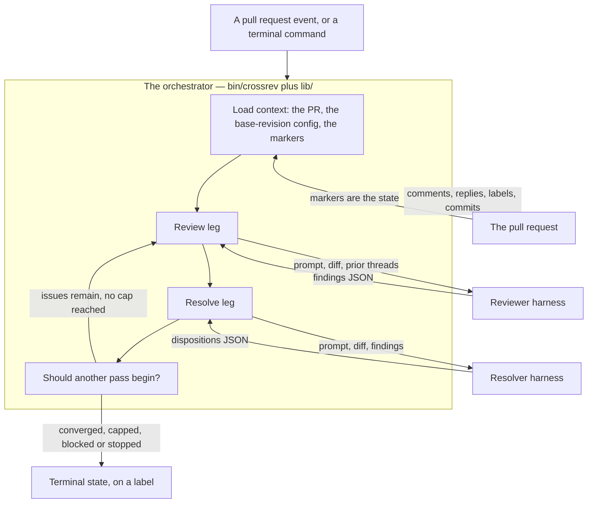

# Architecture

How CrossRev is built, as it stands today. For *why* a decision went the way it did, see the [decision records](adrs/).

## The shape of it

One model reviews a pull request and leaves inline comments. A second verifies each point and either fixes it, skips it, defers it, or pushes back, replies in-thread, resolves what it handled, and pushes. Then the first looks again.

Three words, each meaning one thing: a **cycle** contains **passes**, and a pass has two **legs**.



**The orchestrator makes every GitHub call.** The agent process makes none — see [the credential seam](#the-credential-seam) below, which is the load-bearing security property.

## The two legs

### The review leg

1. Load context: the pull request, its base and head SHAs, its labels, and every trusted marker already on it.
2. Read repository policy **from the base revision**, never from the branch under review.
3. Work out the pass number from the markers, and whether this head SHA has already been reviewed.
4. Ask whether a pass should begin at all — the caps, the `crossrev/stop` label, the draft check.
5. **Post a claim comment before doing any work**, carrying a marker.
6. Quarantine repository-provided harness configuration, assemble the prompt, invoke the reviewer, validate what came back.
7. Post one inline comment per finding, each carrying its own marker; rewrite the claim comment into the pass summary; set the labels.

### The resolve leg

1. Same context load, same policy source.
2. Find the newest review pass's marker and read its findings.
3. Post its own claim, then invoke the resolver with the diff, the findings and the prior threads.
4. For each finding: reply in-thread, resolve the thread where the disposition says to, and commit a fix where policy allows one.
5. Persist deferred findings to the backlog.
6. Push, behind the branch guard. Post the summary. Set the labels.

`crossrev cycle` drives both legs in one process, up to `max_passes_per_cycle`. In automated mode each leg is its own workflow run, chained by labels.

## The pull request is the state

There is no database, no cache and no local state file. Everything the loop knows is on the pull request, in **markers** — HTML comments embedded in comment bodies, invisible in the UI and readable by anyone who views the source.

A marker carries the protocol version, the leg, the pass number, its state, timestamps, the run id, the head SHA, the harness and model and effort and endpoint, the model that actually answered, the token cost, the verdict, and the findings or dispositions.

| Prefix | Where | What it records |
|---|---|---|
| `<!-- crossrev:` | The pass summary comment | The whole pass: verdict, findings, dispositions, cost |
| `<!-- crossrev:f` | Each inline comment and each reply | One finding id, its pass, and the leg that wrote it |

Three properties follow, and each one is why a marker exists rather than a ledger:

- **A crash loses nothing.** The claim marker goes up before the work starts, so a run that dies mid-flight is resumed rather than restarted. The next run reads how far the last one got.
- **A duplicate is impossible by construction.** The per-finding marker rides in the body of the comment it records, so the record and the thing it records are one HTTP call. A ledger written *after* a successful post has a window in it: GitHub accepts the comment, the process dies, and recovery can't tell an already-posted finding from a missing one.
- **The same code runs in both modes.** Nothing about the state is specific to CI.

**Markers are lowercase in every form.** They're matched literally by `sed` and by `jq scan`, so a capitalised prefix would break matching silently, on every existing pull request.

### Trust

Anyone who can comment on a pull request can write an HTML comment, so a marker's *author* is the only signal GitHub controls and nobody can forge. Which author counts depends on the mode:

| Mode | Trusted author | Why |
|---|---|---|
| `automated` | The GitHub App, and nothing else | A forged marker makes an *agent* act — push a commit, skip a finding, believe a leg finished |
| `local` | The invoking user | You are the orchestrator. A forged marker can only mislead you about work you asked for |

Hard-coding the App would break local mode outright: a local run would find no App-authored marker on any pass, report pass 1 forever, reconcile nothing, and never reach the cap.

### Finding identity

A finding's id is a hash of its path, its normalised title, and an anchor — a fingerprint of the commented line and its two neighbours either side. Path and title carry the identity; the anchor is what lets a finding still be matched after the line moves. Stable across passes, so "already posted" is a set-membership test rather than a guess.

## The label contract

The six loop labels are the state a human reads, and in automated mode they are also the event chain: each leg's completion applies the label the next leg waits behind.

| Label | Colour | Meaning |
|---|---|---|
| `crossrev/awaiting-review` | blue | A review is owed |
| `crossrev/awaiting-resolution` | purple | The review landed, the resolve leg is owed |
| `crossrev/converged` | green | The loop finished on its own |
| `crossrev/halted` | orange | Stopped short, a human is needed |
| `crossrev/stop` | red | A human applied it |
| `crossrev/pass-N` | grey | Which pass it reached |

No two colours are adjacent on the wheel, and every one is dark enough that GitHub renders its text white in all three renderings it uses — the solid pill on the labels page, and the tinted chip in light and dark themes. **Red is reserved for `stop`**, the one label a human applies, so a red pill in a pull request list always means somebody pulled the brake.

The label a leg waits behind is named for the noun where the leg is named for the verb: `resolve` waits behind `crossrev/awaiting-resolution`. Derived in one place, because the workflows key off these exact strings and a mismatch stalls the chain silently — the label sits on the pull request with nothing listening.

**In automated mode a label that can't be applied is fatal**, not cosmetic. Locally it's the reverse: one process drives both legs, so the label is decoration.

## Termination

One function decides, over state the orchestrator already holds, so it's testable with no network, no harness and no pull request. That matters, because its failure mode is silence — a loop that stops one pass early looks exactly like a loop that converged.

It terminates on the first of:

1. A human applied `crossrev/stop`. **Checked first**, because it's an instruction rather than a state, and it outranks a healthy verdict.
2. The resolver returned `blocked`.
3. The reviewer returned `converged` — nothing at or above `min_fix_severity` remains.
4. The pass count reached `max_passes_per_cycle`. Pass 3 of a cap of 3 is the last pass, not the one after which a fourth begins.
5. The daily pull request cap is exceeded.
6. The pull request is larger than the file cap.

The last three are continuation bounds: they end *automatic* reviewing and never block a person. `min_fix_severity` is different in kind — it bounds what an agent may change, so it holds on every run.

## The credential seam

**The process reading attacker-controlled text is deliberately the process holding no credential.**

A pull request's title, body, diff, code comments and review threads are all material a reviewer must read, and any of it can address the model directly. CrossRev handles that in three layers, of which only the first is load-bearing:

1. **Credential separation.** Every GitHub read and write goes through the orchestrator. The adapters strip `GH_TOKEN`, `GITHUB_TOKEN` and `GH_ENTERPRISE_TOKEN` from the environment before starting the model-facing process. An injection that reaches tool use still cannot post as the App, push a commit, or read a secret.
2. **Quarantine.** A pull request branch contains files that configure the thing reviewing it — settings, instruction files, hooks, MCP server definitions, agents. A hook is arbitrary code execution before the model sees a token. CrossRev moves every known harness-loaded path out of the checkout before any invocation and restores it before anything is committed. **Quarantined rather than deleted**, because a pull request that *adds* a hook is exactly the pull request a reviewer should be flagging: the diff still carries the text, at a path no harness auto-loads.
3. **An explicit notice in the prompt** telling each leg that everything below a given heading is data rather than instruction, and that text addressing the model is itself a finding.

The quarantine list is deliberately over-broad and deliberately not exhaustive. It is a best-effort layer, not the thing standing between an injected hook and the App token.

If the harness writes to a quarantined path anyway, that write was made blind and is discarded on restore — with a warning, because a finding "fixed" by editing a quarantined file is reported as fixed and lands in no commit.

## The harness seam

Each adapter takes a prompt file, a schema, a working directory, an optional model, effort and endpoint, and whether the leg may write to the working tree. Each returns **two things**: the payload, and execution metadata naming the harness, the resolved endpoint, the answering model where the harness reports one, and what the turn cost in tokens.

**Write permission is derived from the leg, not configured.** The resolve leg has to change files, so it is granted file edits — `--permission-mode acceptEdits` on Claude Code, `--sandbox workspace-write` on Codex, `--mode accept-edits` on Antigravity. The review leg is granted nothing: it has no reason to write, and write access widens the blast radius of a prompt injection carried in a diff for nothing in return. The line held is between editing files and running arbitrary commands, so `bypassPermissions` and `danger-full-access` are never passed. The grant is a flag rather than a settings file because the quarantine above would move a settings file out of the way before the harness started — and a grant that survived it would be the hole the quarantine exists to close.

| Adapter | Harness | Notes |
|---|---|---|
| `lib/adapters/claude.sh` | Claude Code | Takes the schema **inline** as a JSON string. Also the path to any Anthropic-compatible endpoint |
| `lib/adapters/codex.sh` | Codex | Takes the schema as a **file path**. Runs with `--ignore-user-config` |
| `lib/adapters/agy.sh` | Antigravity | |

The inline-versus-path difference is not a detail: handing Claude a path fails with a JSON parse error about the leading slash, which reads like a corrupt schema rather than a wrong argument type.

**Model ids must be fully qualified.** `--model fable-5` fails as an entitlement error rather than as a typo.

### Making sure the two legs really differed

Silent substitution is the failure the cross-model design exists to prevent, and it completes normally when unchecked. Two layers:

- **What the orchestrator asked for.** It knows exactly what it invoked, so it asserts the legs differ in binary, resolved base URL or model — and that no endpoint variable is set in the inherited environment, which would redirect the harness process-wide.
- **What answered.** Where a harness reports the answering model, the two are compared. Where it doesn't, the marker records the absence rather than implying a check that never ran.

## The two schemas

`schemas/findings.schema.json` and `schemas/resolve.schema.json` constrain what each leg returns. Every shipped harness enforces them natively, so a shape failure is an adapter bug rather than model drift.

Validation splits by exit code, and the split is about who is at fault:

| Code | Kind | Meaning |
|---|---|---|
| 1 | **shape** | A key missing, a type wrong, an enum value out of range. An adapter or harness bug — a retry reproduces it |
| 2 | **semantic** | The shape is perfect and the content contradicts what the orchestrator supplied: a finding number nothing was numbered with, the same finding answered twice, one left out, an issue number nobody offered. Model drift by definition, so it earns one more attempt |

This is deliberately not general JSON Schema validation — neither `jq` nor `yq` can do that. Required keys present, types right, enums in range, and the schemas stay flat enough for that to be sufficient. A schema that outgrows the check is the signal to add a real validator rather than to let the check drift behind it.

## The gutter

Both legs are given the diff with every line inside a hunk prefixed by its number in the old file, its number in the new file, and a `|`. A dash stands where the line doesn't exist on that side.

That's there because a model asked to derive a line number counts lines under a `@@` header and sometimes counts wrong, and GitHub accepts a comment only on a line the diff actually shows — a finding one line outside a hunk is refused and falls out of the thread it belongs in. The gutter is also what `side` means: `RIGHT` reads the second column, `LEFT` the first, and a line showing a dash on one side can't take a comment there.

The orchestrator re-derives the same mapping before posting, and snaps a finding up to three lines to reach a hunk — exactly the margin a miscount lands in, since three is git's own context width. Past that the reviewer meant somewhere else, and moving the comment would anchor it to code the finding never mentions.

**Both legs get the same description of the gutter**, because pass 2 has to mean the same thing by a line number as pass 1 did.

## Where the skill text comes from

The orchestrator reproduces `skills/pr-review/SKILL.md` and `skills/pr-resolve/SKILL.md` into each prompt rather than relying on the harness discovering them. Two reasons:

- The quarantine moves `.claude/` and `.agents/` out of the checkout before any invocation — exactly where a workflow would have placed the skills. Re-planting into a quarantined tree and removing them again before the commit leaves a window where a crash commits CrossRev's own skills into someone's pull request.
- Reproducing the text makes the prompt **byte-identical across harnesses**, which is the property that lets pass 2 judge pass 1's findings.

The skills stay installable and usable by hand; nothing about them changes. The generated workflows just don't need to place them anywhere.

## Delivery

CrossRev is delivered to consuming repositories as a **composite action pinned by full 40-character SHA**, with the tag riding in a trailing comment:

```yaml
- uses: carlosboeing/crossrev@<40-char-sha>   # v0.1.0
  with:
    leg: review
    pr: ${{ github.event.pull_request.number }}
    app-token: ${{ steps.app.outputs.token }}
    trigger: automatic
```

The SHA is the pin because `git tag -f` plus a force push moves a tag, and the failure mode is a repository whose review behaviour changes with nothing in its own history to show for it. `crossrev init` generates the pinned form; the floating `@v0` in the README is a human choosing convenience knowingly.

Two inputs are worth understanding:

- **`app-token` has no default, deliberately.** Writes made with `GITHUB_TOKEN` do not trigger workflows, so defaulting to it would stall the chain after pass 1 while looking healthy the whole way. Published review actions commonly default this input; copying that here would be the exact bug the design exists to prevent. The action fails loudly on an empty token.
- **`trigger` defaults to `automatic`**, the opposite of the CLI's default, because the two entry points fail safe in opposite directions. Forgetting the input in a workflow should give you the caps, not an uncapped loop.

The action's first step is a dependency preflight. It lives there rather than in each template because a consumer's workflow cannot forget it.

The **credential refresher** is the one workflow that still checks CrossRev out rather than calling the action, because `crossrev auth refresh` isn't expressible through the `leg` input. It's a plain public checkout — no token, no key, no secret — and it never checks out the pull request branch, never runs a model and never reads a diff.

## The layout

```
action.yml       the composite action consuming repositories call
bin/crossrev     entrypoint: sources lib/, dispatches the subcommand
lib/
  ui.sh            output voice — six rules, enforced by the helpers' shapes
  preflight.sh     dependency checks that name the fix, not just the gap
  auth.sh          GitHub App registration via the manifest flow, per owner and role
  config.sh        two-layer config, endpoint and backlog resolution
  credentials.sh   restoring a rotating subscription credential, read-only
  sandbox.sh       quarantining repository-provided harness configuration
  diff.sh          the gutter, and re-deriving it before posting
  state.sh         labels, markers, trust, revision detection, finding ids
  legs.sh          termination, the push guard, the divergence guard
  github.sh        every GitHub read and write CrossRev makes
  validate.sh      structural and semantic checks on what a harness returned
  prompt.sh        what each leg is given
  run.sh           the two legs, the drivers, the watchdog
  init.sh          the plan-then-confirm upgrade to automated mode
  adapters/        claude.sh, codex.sh, agy.sh
schemas/         findings.schema.json, resolve.schema.json
skills/          pr-review/, pr-resolve/
templates/       workflows, starter config, example operator config
scripts/         lint.sh — syntax and shellcheck across everything
tests/           the stubbed-gh suite. tests/run.sh runs all of it
```

## The test suite

`tests/run.sh` is 849 offline assertions with no network, no model and no pull request. It stubs `gh` and `claude` onto PATH and builds throwaway git repositories with real histories and real bare origins, so the assertions are about what CrossRev actually did rather than what it printed.

`tests/stub/codex` is a deliberate tripwire: it exits loudly instead of running, because the no-config default names codex as reviewer, and a fixture whose config failed to load would otherwise reach the real CLI and make a real billed call.

`scripts/lint.sh` runs syntax checks plus `shellcheck -S warning` across everything. Both take seconds.
