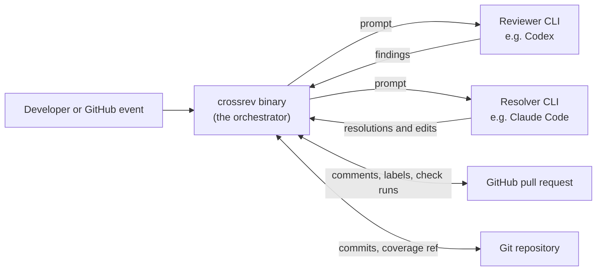
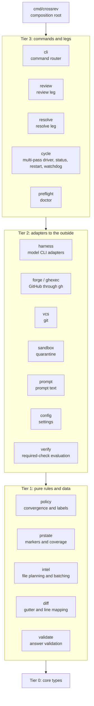
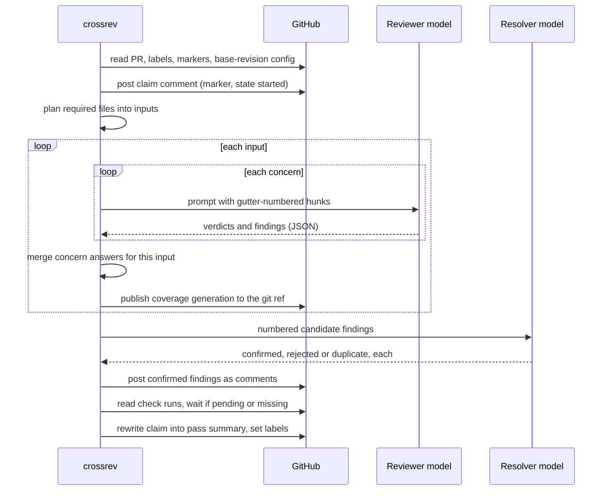
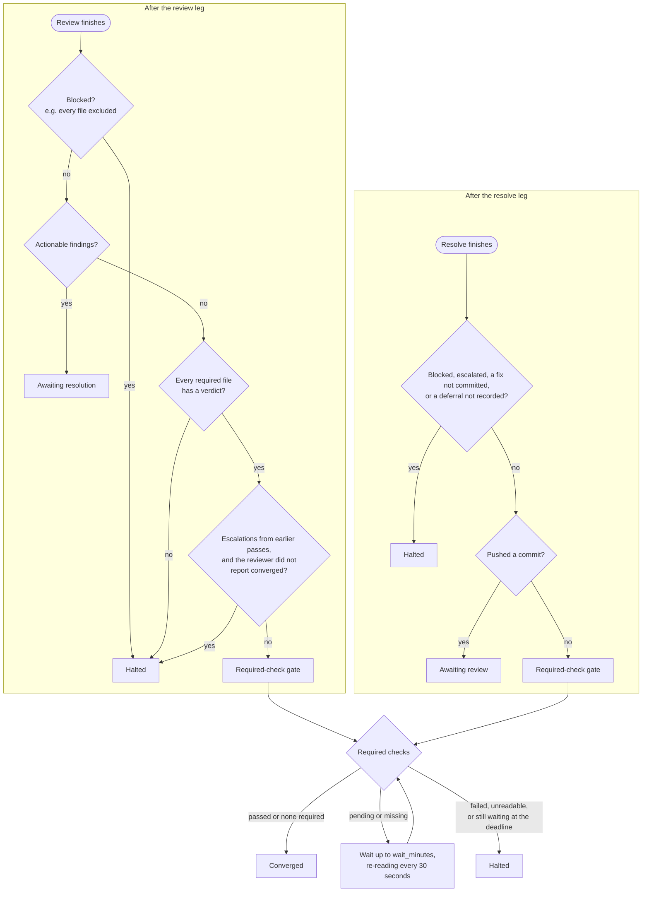
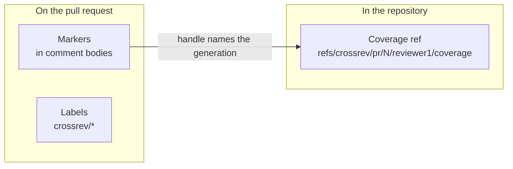
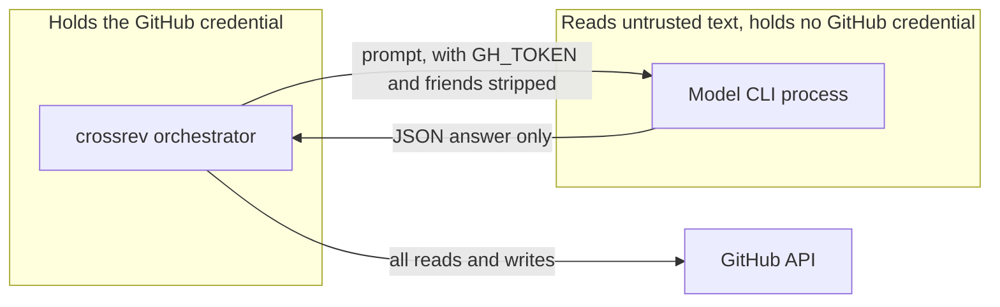
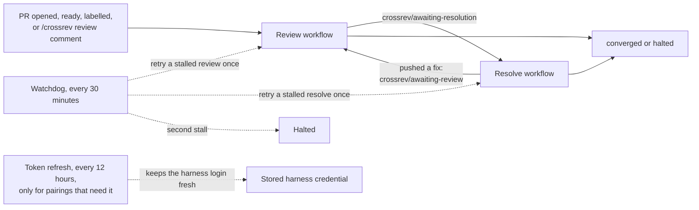

# Architecture

This page explains how CrossRev is built today: its parts, how one review round runs, where its state lives, and where its security boundaries sit. It is for an engineer meeting CrossRev for the first time. Decisions and their reasons live in the [decision records](adrs/); settings live in [configuration](configuration.md).

## 1. What CrossRev does

CrossRev runs a code review loop between two AI models on a GitHub pull request. One model reviews the change and posts findings as inline comments. A second model answers each finding: it fixes it, disputes it, skips it or defers it, replies in the thread, and pushes any fix. Then the first model reviews again. The loop ends when nothing worth fixing remains, when a limit is reached, or when a person stops it.

The models run through the command-line tools you already pay for (Claude Code, Codex and others), not through API keys. The same binary runs the loop from a terminal or from GitHub Actions.


```mermaid
flowchart LR
    dev["Developer or GitHub event"] --> bin["crossrev binary<br/>(the orchestrator)"]
    bin -->|"prompt"| rv["Reviewer CLI<br/>e.g. Codex"]
    rv -->|"findings"| bin
    bin -->|"prompt"| rs["Resolver CLI<br/>e.g. Claude Code"]
    rs -->|"resolutions and edits"| bin
    bin <-->|"comments, labels, check runs"| pr["GitHub pull request"]
    bin <-->|"commits, coverage ref"| repo["Git repository"]
```

The binary is the only part that talks to GitHub. The model tools never receive a GitHub credential. Section 8 explains why that matters.

## 2. Terms

CrossRev uses a small vocabulary. Each word below means one thing.

| Term | Meaning |
|---|---|
| **Cycle** | A run of the loop on one pull request, from the first review until it ends. Made of passes. |
| **Pass** | One round: a review followed by a resolve. Numbered from 1, and shown on the `crossrev/pass-N` label. |
| **Leg** | One half of a pass. The **review leg** finds problems; the **resolve leg** answers them. |
| **Harness** | A model command-line tool CrossRev drives, such as Claude Code or Codex. Each has an **adapter** in the binary. |
| **Reviewer / resolver** | The harness and model configured for each leg. They should be different models, so one catches what the other misses. |
| **Finding** | One problem the reviewer reports: file, line, severity, title, explanation. |
| **Resolution** | The resolver's answer to one finding: `fixed`, `disputed`, `skipped`, `deferred` or `escalated`. |
| **Concern** | What the reviewer is asked to look for in one model call: `correctness` (bugs in the logic) or `consistency` (the change against the code around it). |
| **Cross-model check** | Before findings post, the resolver's model reads each one and confirms it, rejects it, or marks it a duplicate. Only confirmed findings post. |
| **Required checks** | GitHub check runs (your CI jobs) that must pass on the pull request's head commit before CrossRev reports it finished. Not to be confused with the cross-model check. |
| **Required file** | A changed file the review must give a verdict on. |
| **Coverage** | The record of which required files have a verdict at the current head. Stored as **generations** in a git ref. |
| **Marker** | An HTML comment inside a CrossRev comment that carries machine-readable state. Invisible in the GitHub UI. |
| **Converged** | The loop finished on its own: nothing at or above the fix threshold remains, every required file has a verdict, and the required checks passed or none are required. |
| **Halted** | The loop stopped short and needs a person. Each halt names its reason, such as `required_check_failed`. |

## 3. Components

CrossRev is one Go binary. Its packages sit in tiers. A package imports from lower tiers, a few Tier 2 packages may also import named Tier 2 peers, and `cmd/crossrev` wires everything together as the composition root. `internal/archtest` enforces these rules.


```mermaid
flowchart TB
    subgraph t3["Tier 3: commands and legs"]
        cli["cli<br/>command router"]
        review["review<br/>review leg"]
        resolve["resolve<br/>resolve leg"]
        cycle["cycle<br/>multi-pass driver, status, restart, watchdog"]
        preflight["preflight<br/>doctor"]
    end
    subgraph t2["Tier 2: adapters to the outside"]
        harness["harness<br/>model CLI adapters"]
        forge["forge / ghexec<br/>GitHub through gh"]
        vcs["vcs<br/>git"]
        sandbox["sandbox<br/>quarantine"]
        prompt["prompt<br/>prompt text"]
        config["config<br/>settings"]
        verify["verify<br/>required-check evaluation"]
    end
    subgraph t1["Tier 1: pure rules and data"]
        policy["policy<br/>convergence and labels"]
        prstate["prstate<br/>markers and coverage"]
        intel["intel<br/>file planning and batching"]
        diff["diff<br/>gutter and line mapping"]
        validate["validate<br/>answer validation"]
    end
    core["Tier 0: core types"]
    root["cmd/crossrev<br/>composition root"] --> t3
    t3 --> t2 --> t1 --> core
```

| Component | Responsibility |
|---|---|
| `review` | Runs the review leg: plans the files, calls the reviewer once per input and concern, runs the cross-model check, posts findings, publishes coverage, applies the gate and labels. |
| `resolve` | Runs the resolve leg: calls the resolver with the findings, replies to threads, commits and pushes fixes, settles the pass. |
| `cycle` | Drives both legs in one process for local runs, and implements `status`, `restart` and the watchdog. |
| `policy` | Pure functions that decide convergence, the next label and whether another pass may start. No network, so fully table-tested. |
| `prstate` | Reads and writes markers, finding identity, and the coverage ledger. |
| `intel` | Decides which files a pass must cover and how they are packed into model calls. |
| `harness` | One adapter per model CLI: builds the command line, strips credentials, parses the answer and token usage. |
| `forge/ghexec` | Every GitHub read and write, through the `gh` CLI. |
| `verify` | Reads the head commit's check runs and judges them against the required checks, including the bounded wait. |
| `sandbox` | Moves files a pull request could use to configure a harness out of the checkout before any model runs. |

The full file list is in [the layout](#the-layout).

## 4. One pass, step by step

### 4.1 The review leg


```mermaid
sequenceDiagram
    participant O as crossrev
    participant G as GitHub
    participant R as Reviewer model
    participant C as Resolver model
    O->>G: read PR, labels, markers, base-revision config
    O->>G: post claim comment (marker, state started)
    O->>O: plan required files into inputs
    loop each input
        loop each concern
            O->>R: prompt with gutter-numbered hunks
            R-->>O: verdicts and findings (JSON)
        end
        O->>O: merge concern answers for this input
        O->>G: publish coverage generation to the git ref
    end
    O->>C: numbered candidate findings
    C-->>O: confirmed, rejected or duplicate, each
    O->>G: post confirmed findings as comments
    O->>G: read check runs, wait if pending or missing
    O->>G: rewrite claim into pass summary, set labels
```

1. **Load context.** Read the pull request, its base and head commits, its labels and every trusted marker on it. Read settings **from the base branch**, never from the branch under review.
2. **Decide whether to run.** Work out the pass number. Stop if `crossrev/stop` is applied, the head was already reviewed, or a limit is reached.
3. **Claim.** Post a summary comment with a marker before any work, so a run that dies can be resumed.
4. **Plan.** List the required files and pack them into model calls that fit the harness's input window. A file too big for one call is split into parts.
5. **Review.** Call the reviewer once per input per concern: `correctness` first, then `consistency`. Each call returns a verdict per file and any findings, validated against `schemas/findings.schema.json`.
6. **Merge and record.** Combine the concern answers for the input. The same finding from both concerns becomes one finding. If either concern could not review a file, the file's verdict is `could_not_review`, which blocks convergence. Each accepted input publishes a new coverage generation to the git ref straight away, so an interrupted pass resumes from the inputs still waiting.
7. **Cross-model check.** Send every merged finding, numbered, to the resolver's model in read-only mode. It confirms, rejects, or marks each a duplicate, and may correct a severity. Rejected findings stay on the marker with the reason; they do not post. If the check call fails past its retries, every finding posts unchecked and the summary says `check: degraded`; if the checker cannot run at all, it says `check: unavailable`. A safety failure is different: a command run by the checker, a credential, endpoint or hardening refusal, a failed restore of quarantined files, or cancellation stops the pass and publishes nothing, the same as in the review itself.
8. **Post.** Each confirmed finding posts once, with its own marker: inline on its line when the diff shows that line, as a file-level comment when the file is in the diff but the line is not, and as a comment on the pull request itself when the file is outside the diff or GitHub refuses the anchor. A finding already posted on an earlier pass is not posted again. On later passes, findings below `min_fix_severity` are held: listed in the summary and recorded on the marker, but not posted.
9. **Gate.** If the pass would converge, judge the required checks. Wait for pending or missing ones, then converge or halt.
10. **Finish.** Rewrite the claim into the pass summary and apply the next label.

The pass then ends one of three ways:
- **Actionable findings:** hand over to the resolve leg with `crossrev/awaiting-resolution`.
- **No actionable finding, and every required file has an accepted verdict:** converge at step 9, subject to the gate.
- **No actionable finding, but files remain without a verdict or marked `could_not_review`:** halt with verdict `blocked`. The resolver has nothing to fix, so a person must look.

### 4.2 The resolve leg

1. **Load context** the same way, and read the review leg's findings from its marker.
2. **Claim**, then call the resolver with the diff, the findings and the existing threads. Each finding carries two hints: whether an earlier pass already fixed the same point (so the earlier fix may be incomplete), and up to 10 places elsewhere where the same identifiers occur.
3. **Validate the answers**: one resolution per finding, and fixes only where policy allows, at or above `min_fix_severity`.
4. **Record deferrals** in the configured backlog.
5. **Commit and push** the fixes behind a branch guard.
6. **Reply.** Answer each finding in its thread, and resolve the thread where the resolution says to.
7. **Settle.** A pass that pushed hands back to review with `crossrev/awaiting-review`. A pass that settled every finding without pushing can converge directly, behind the same required-check gate as the review.

### 4.3 How a pass ends

Each leg ends by choosing the next label. `crossrev/stop` is checked first on both legs and always wins.


```mermaid
flowchart TD
    subgraph rv["After the review leg"]
        r0(["Review finishes"]) --> r1{"Blocked?<br/>e.g. every file excluded"}
        r1 -->|yes| rh["Halted"]
        r1 -->|no| r2{"Actionable findings?"}
        r2 -->|yes| rr["Awaiting resolution"]
        r2 -->|no| r3{"Every required file<br/>has a verdict?"}
        r3 -->|no| rh
        r3 -->|yes| r4{"Escalations from earlier passes,<br/>and the reviewer did not<br/>report converged?"}
        r4 -->|yes| rh
        r4 -->|no| rg["Required-check gate"]
    end
    subgraph sv["After the resolve leg"]
        s0(["Resolve finishes"]) --> s1{"Blocked, escalated, a fix not committed,<br/>or a deferral not recorded?"}
        s1 -->|yes| sh["Halted"]
        s1 -->|no| s2{"Pushed a commit?"}
        s2 -->|yes| sr["Awaiting review"]
        s2 -->|no| sg["Required-check gate"]
    end
    gate{"Required checks"}
    rg --> gate
    sg --> gate
    gate -->|"passed or none required"| conv["Converged"]
    gate -->|"pending or missing"| wait["Wait up to wait_minutes,<br/>re-reading every 30 seconds"]
    wait --> gate
    gate -->|"failed, unreadable,<br/>or still waiting at the deadline"| gh["Halted"]
```

The caps (`max_passes_per_cycle`, the daily pull request cap and the file-count cap) are checked when a review is about to start. A refused start halts the pull request. A pass that converges on the last allowed pass still converges.

A failing check never becomes a code finding. It halts the pass with one of `required_check_pending`, `required_check_missing`, `required_check_failed` or `required_checks_unreadable`, naming each blocking check with its run URL. `crossrev restart --pr N` drives the pass again once the checks report. A restart that only needs the checks re-judged makes no model call.

## 5. The pull request is the state

CrossRev keeps no database, cache or local state file. Everything it knows lives in three places, all owned by the repository.


```mermaid
flowchart LR
    subgraph pr["On the pull request"]
        m["Markers<br/>in comment bodies"]
        l["Labels<br/>crossrev/*"]
    end
    subgraph git["In the repository"]
        ref["Coverage ref<br/>refs/crossrev/pr/N/reviewer1/coverage"]
    end
    m -->|"handle names the generation"| ref
```

### 5.1 Markers

A marker is an HTML comment such as `<!-- crossrev:{...} -->` inside a comment CrossRev posted.

| Prefix | Where | What it records |
|---|---|---|
| `<!-- crossrev:` | The pass summary comment | The pass: leg, number, state, head commit, harness and model, verdict, findings or resolutions, token usage, cross-model check decisions, required-check evidence, and the handle of its coverage generation |
| `<!-- crossrev:f` | Each inline comment and reply | One finding id, its pass, and the leg that wrote it |

Three properties follow from keeping state in markers:

- **A crash loses nothing.** The claim goes up before the work, so the next run sees how far the last one got and resumes.
- **A duplicate comment is impossible.** A finding's marker is inside the comment it records, so posting the comment and recording it are one API call.
- **Local and automated runs share one code path.** Nothing about the state is specific to CI.

**Markers are versioned.** New markers are written as `v:2`. A `v:1` marker still reads for its findings and pass number but carries no coverage. A marker from a newer version than this build understands is refused.

**Only trusted authors count.** Anyone can write an HTML comment, so CrossRev reads markers only from one author: the GitHub App in automated mode, and the invoking user locally.

**A finding's id** is a hash of its path, its normalised title and a fingerprint of the line and its neighbours. It stays stable across passes, so "already posted" is a lookup, not a guess.

Markers and labels are lowercase and matched literally. Changing their case would break every existing pull request silently.

### 5.2 Labels

Labels are the state a person reads. In automated mode they are also the event chain: each leg ends by applying the label the next workflow waits for.

| Label | Colour | Meaning |
|---|---|---|
| `crossrev/awaiting-review` | blue | A review is owed |
| `crossrev/awaiting-resolution` | purple | The review landed, a resolve is owed |
| `crossrev/converged` | green | The loop finished on its own |
| `crossrev/halted` | orange | Stopped short, a person is needed |
| `crossrev/stop` | red | A person applied it to stop the loop |
| `crossrev/pass-N` | grey | The pass reached |

A seventh label, `crossrev/watchdog-retried` (yellow), is bookkeeping: it marks a leg the watchdog has already retried once. Red is reserved for `stop`, the one label a person applies. In automated mode a label that cannot be applied fails the leg, because a missing label silently breaks the chain.

### 5.3 The coverage ledger

Each review pass publishes a **generation**: a git commit holding `manifest.json` and `records.json`, parented on the previous generation, under one ref per pull request per reviewer slot. It holds one record per required file: its verdict, the evidence, and a digest of exactly what the reviewer was shown. The pass marker names the generation by commit, and readers trust that handle, not the ref.

A generation is reused only when the base commit, head commit, reviewer, and **engine id** all match. The engine id is `hunk-v2` plus a digest of the settings the pass ran with: concerns, cross-model check mode, input policy and read mode. A pass run under other settings never reuses another's verdicts. The marker records the engine id so later readers judge the generation by what actually ran.

If the ref cannot be written, `coverage.store: auto` falls back to storing the generation in the marker comment, within GitHub's 64 KiB comment limit. A ledger that can no longer be read means the next pass re-reviews; one that fails verification fails the pass closed. [What CrossRev writes](what-crossrev-writes.md) lists every write; [ADR 0022](adrs/0022-the-coverage-ledger-lives-in-git-refs.md) records the decision.

## 6. When a pull request converges

One function in `internal/policy` decides convergence. Every route that can apply `crossrev/converged` calls it: the review leg's publish, the resolve leg's no-commit settle, and the resolve leg's no-findings route. `crossrev status` and the local cycle read the same rule, so the label, the terminal and the status report cannot disagree.

A pull request converges when all of these hold:

- No finding the pull request introduced remains at or above `min_fix_severity`. Pre-existing and lower-severity findings are reported but do not block.
- Every required file has an accepted verdict, and none is `could_not_review`.
- Any repair the resolver made has been re-read by the reviewer.
- The required checks passed, or none are configured.

Converged means the review is complete. It does not mean the code is correct, and it means checks passed only when checks are required. The coverage manifest's own `verification.status` stays `not_implemented`, because CrossRev runs no checks itself; the gate's evidence lives on the pass marker.

The loop also ends, in this order of precedence, when:

1. A person applied `crossrev/stop`. Checked first, because it is an instruction.
2. The resolver reported `blocked`, or escalated a finding to a person.
3. The pass count reached `max_passes_per_cycle`.
4. The daily pull request cap or the file-count cap is exceeded.

The last two end automatic reviewing only. A review a person asks for still runs.

## 7. What a review covers

**Every changed file is read, unless policy excludes it.** Added, modified, deleted, renamed and type-changed paths between the base and head commits are required files, except files marked `linguist-generated` in `.gitattributes` and the repository's own backlog file. A pull request whose changed files are all excluded halts without calling a model. A pass reads at most 400, in batches of at most 40 in path order. Generated files too large to show whole are skipped with a warning.

**Files arrive as numbered hunks.** Each line of a hunk carries its old line number, its new line number and a `|`, with a dash where the line does not exist on that side. Models miscount lines under a bare `@@` header, and GitHub refuses a comment on a line the diff does not show, so the numbers are given rather than derived. CrossRev re-derives the same mapping before posting and moves a comment at most three lines to reach a hunk. Under the default `review.input_policy: hunks_first`, a file arrives in one of three forms:

| Form | When | What the reviewer sees |
|---|---|---|
| `full_text` | New, deleted, or at most 8 KiB | The whole file as one hunk |
| `hunks_context` | Larger edited files | Each change with its enclosing function, clipped to 100 lines of context |
| `diff_only` | Binary, unreadable, rename-only or mode-only | The diff header and the reason, no content |

Under `whole_when_fits`, an edited file is sent whole whenever its whole form fits the call, and as hunks otherwise.

**A verdict covers only what was shown.** The spans each side showed are the supplied ranges. Evidence for a verdict must cite lines inside them, and lines outside them are recorded as unseen in `known_limits`, never as evidence ([ADR 0026](adrs/0026-coverage-counts-supplied-bytes-only.md)).

**Calls are sized to the harness.** Each call's full prompt is measured against a packing target derived from the model's input window, for example 390,000 bytes for Codex and 312,000 for Claude Code at their default models, and 120 KiB where the prompt travels as a command argument. A configured model with a smaller window lowers the target. Calls pack up to the target. Shared context, the part every call repeats such as the pull request description, is judged on its own: past 0.75 of the target, calls run over budget and record `over_budget`, and past the hard limit the pass halts. A file too large for one call splits at hunk boundaries, and its parts merge back into one verdict. That halt is `shared_context_exceeds_window`, and it is the only size limit that stops a pass.

**Model calls per pass.** A review pass makes `k × c + m` accepted calls: `k` inputs, `c` concerns, and `m` cross-model check calls. `m` is zero when the review raised no findings and usually one otherwise. Under the defaults, a one-file pull request makes two calls when clean and three when it has findings. A rejected answer can be retried, which adds attempts but not calls. `review.concerns: [correctness]` with `review.check: off` makes it one call.

## 8. Security boundaries

Pull request titles, bodies, diffs and comments are untrusted text that a reviewer must read, and any of it can try to instruct the model. CrossRev's design rests on one rule: **the process that reads untrusted text holds no credential.**


```mermaid
flowchart LR
    subgraph trusted["Holds the GitHub credential"]
        orch["crossrev orchestrator"]
    end
    subgraph untrusted["Reads untrusted text, holds no GitHub credential"]
        model["Model CLI process"]
    end
    gh["GitHub API"]
    orch -->|"all reads and writes"| gh
    orch -->|"prompt, with GH_TOKEN and friends stripped"| model
    model -->|"JSON answer only"| orch
```

1. **Credential separation.** Every GitHub call goes through the orchestrator. Adapters strip `GH_TOKEN`, `GITHUB_TOKEN`, `GH_ENTERPRISE_TOKEN` and `GITHUB_ENTERPRISE_TOKEN` before starting a model process. On runners, workflows persist no checkout token, legs remove any persisted one, and git authenticates per call through `gh`. An injected instruction that reaches tool use still cannot post, push or read a secret. This is the layer the others back up.
2. **Policy from the base branch.** Settings are read from the base revision, so a pull request cannot loosen the rules it is reviewed under ([ADR 0003](adrs/0003-policy-read-from-the-base-revision.md)).
3. **Quarantine.** A branch can contain files that configure the harness reviewing it: settings, instruction files, hooks, MCP servers. CrossRev moves every known such path out of the checkout before a model runs and restores it before committing. Moved, not deleted, so a pull request that adds a hook is still reviewed as text.
4. **Least privilege per leg.** The review leg gets no write access. The resolve leg may edit files but never run with full bypass modes. Codex and Claude Code review with CrossRev's own read tool as their only way to read files, and their event streams are watched: a review leg that runs a command halts with `review_leg_ran_command` and publishes nothing. If the read tool stops serving, the leg falls back to the prompt alone under the default `.policy.on_reads_unavailable: degrade`, or stops under `halt`. opencode reviews with its read tools denied, and agy reviews from the prompt alone; neither reports command events, so the tripwire cannot run on them, and `crossrev doctor` says so. Grok reviews are refused until its isolation is verified again ([ADR 0027](adrs/0027-review-legs-read-only-through-the-served-tool.md)). The cross-model check runs under the same review isolation.
5. **A prompt notice** tells each leg that everything under a given heading is data, not instruction, and that text addressing the model is itself a finding.

The quarantine and the notice are best-effort layers. Credential separation is the one that holds the line.

## 9. Harness adapters

Each adapter receives a prompt file, a schema, a working directory, an optional model, effort and endpoint, and whether the leg may write. It returns the answer and metadata: which harness and endpoint ran, which model answered where the harness reports it, and normalised token usage. Usage is split into fresh input, cache reads, cache writes and output; `total` is their sum, and reasoning tokens are recorded beside the total, never added to it. `internal/harness` estimates cost from the vendored rates in `assets/prices.json`, and refuses to estimate rather than guess when a rate is missing.

Version gates differ by adapter. Codex and Claude Code review only on the exact CLI version their read isolation was verified on. opencode accepts major versions 1.x and 2.x and refuses anything else. Grok must report a version or the leg is refused, and its reviews are refused on isolation grounds regardless. agy is not version-gated.

<!-- crossrev:harness-table:start -->
<!-- Generated by scripts/render-harness-docs.sh — do not edit -->
| Adapter | Harness | Notes |
|---|---|---|
| `claude` | Claude Code | Takes the schema **inline** as a JSON string. Also the path to any Anthropic-compatible endpoint |
| `codex` | Codex | Takes the schema as a **file path**. Runs with `--ignore-user-config` |
| `agy` | Antigravity | |
| `grok` | Grok | No schema flag: the schema travels inside the prompt, and CrossRev extracts the JSON from the answer text itself. |
| `opencode` | opencode | No schema flag: the schema travels inside the prompt, and CrossRev extracts the JSON from the answer text itself. |
<!-- crossrev:harness-table:end -->

**Answers are validated against three schemas**: `schemas/findings.schema.json` for the review, `schemas/resolve.schema.json` for the resolve, and `schemas/check.schema.json` for the cross-model check. A failure is one of two kinds:

| Kind | Meaning | Response |
|---|---|---|
| Shape | A key missing, a wrong type, an out-of-range value | Where the harness enforces the schema itself, an adapter bug: fails, since a retry reproduces it. Where the schema travels in the prompt (opencode, grok), model drift: one more attempt |
| Semantic | Valid shape, but contradicts what was sent: an unknown finding number, one answered twice or left out | Model drift. One more attempt |

**The two legs must really differ.** CrossRev checks that the legs differ in binary, endpoint or model, and that no inherited environment variable redirects a harness. Where a harness reports the model that answered, the two are compared. A cross-model check that answered as the reviewer's own model is recorded as `same_model`, never as cross-model.

**Prompts carry the skill text.** The orchestrator copies `skills/pr-review/SKILL.md` and `skills/pr-resolve/SKILL.md` into every prompt instead of relying on the harness to find them. That keeps prompts identical across harnesses, and the quarantine would move installed skills out of the checkout anyway.

## 10. Running it: local and automated

| | Local | Automated |
|---|---|---|
| Started by | `crossrev review`, `crossrev resolve` or `crossrev cycle` in a terminal | GitHub Actions workflows that `crossrev init` generates |
| Legs | `cycle` runs both in one process | Each leg is its own workflow run, chained by labels |
| Trusted marker author | The invoking user | The GitHub App only |
| Credential | Your `gh` login | A GitHub App installation token |


```mermaid
flowchart LR
    open["PR opened, ready, labelled,<br/>or /crossrev review comment"] --> rw["Review workflow"]
    rw -->|"crossrev/awaiting-resolution"| sw["Resolve workflow"]
    sw -->|"pushed a fix:<br/>crossrev/awaiting-review"| rw
    rw --> end1["converged or halted"]
    sw --> end1
    cron1["Watchdog, every 30 minutes"] -.->|"retry a stalled review once"| rw
    cron1 -.->|"retry a stalled resolve once"| sw
    cron1 -.->|"second stall"| hlt["Halted"]
    cron2["Token refresh, every 12 hours,<br/>only for pairings that need it"] -.->|"keeps the harness login fresh"| cred["Stored harness credential"]
```

Both event workflows share one concurrency group per pull request, so two legs never write at once. Writes made with `GITHUB_TOKEN` do not trigger workflows, so the chain needs the App token, and the action has no default for it.

**Delivery.** Workflows call CrossRev as a composite action pinned by full 40-character commit SHA, because a tag can be moved ([ADR 0009](adrs/0009-delivery-via-sha-pinned-composite-action.md)):

```yaml
- uses: carlosboeing/crossrev@<40-char-sha>   # v0.1.0
  with:
    leg: review
    pr: ${{ github.event.pull_request.number }}
    app-token: ${{ steps.app.outputs.token }}
    trigger: automatic
```

The action downloads the release binary, checks its digest against the release's `checksums.txt`, and runs `crossrev doctor` before the leg. `trigger` defaults to `automatic`, so a workflow that forgets it still gets the caps.

## 11. Settings that shape a pass

All live in `.github/crossrev.yml` on the base branch. Each review setting also has a flag for one local run; automated mode refuses those flags. The run log records each effective value and where it came from. Full reference: [configuration](configuration.md).

| Setting | Default | Effect | Flag |
|---|---|---|---|
| `review.concerns` | both | Which concerns each input is reviewed for | `--concerns` |
| `review.check` | `resolver` | Run the cross-model check, or `off` | `--check` |
| `review.input_policy` | `hunks_first` | How files are shown to the reviewer | `--input-policy` |
| `verification.required_checks` | none | Check runs that must pass, as `NAME` or `NAME@APP` | `--required-check`, `--no-required-checks` |
| `verification.wait_minutes` | `10` | How long a leg waits for pending checks, 0 to 30 | `--check-wait` |
| `policy.min_fix_severity` | `medium` | Lowest severity the resolver may change code for | |
| `policy.max_passes_per_cycle` | `3` | Passes in one cycle | |
| `policy.max_files_changed_per_pr` | `200` | Largest pull request reviewed unattended | |
| `policy.max_prs_per_day` | `25` | Pull requests reviewed per rolling 24 hours | |

## The layout

```
action.yml       the composite action consuming repositories call
cmd/crossrev/    the entrypoint: CLI table, wiring, legs, init
assets/          data compiled into the binary
  harnesses.json   the validated descriptor for every harness fact
  prices.json      vendored token rates for the usage estimate, stamped with its upstream revision
internal/        Go packages, in tiers
  core/            Tier 0: domain primitives and FindingID
  buildinfo/       Tier 1: version and build metadata
  policy/          Tier 1: convergence, labels and termination rules
  prstate/         Tier 1: markers, finding identity, coverage ledger stores
  diff/            Tier 1: gutter mapping, hunk snapping, supplied line ranges
  validate/        Tier 1: answer validation for all three schemas
  intel/           Tier 1: required files, input planning, batching and splitting
  config/          Tier 2: configuration loading and validation
  prompt/          Tier 2: assembled prompt text
  exec/            Tier 2: command execution and the environment allowlist
  ui/              Tier 2: output and formatting
  runlog/          Tier 2: run log and redaction
  vcs/             Tier 2: git operations
  sandbox/         Tier 2: harness quarantine
  forge/           Tier 2: forge abstractions
  forge/ghexec/    Tier 2: GitHub CLI adapter
  cred/            Tier 2: credential resolution
  harness/         Tier 2: model harness adapters and token usage
  symbols/         Tier 2: symbol indexing and worker entrypoint
  verify/          Tier 2: required-check evaluation and the shared wait
  verify/ghactions/ Tier 2: GitHub Actions simulation
  testgen/         Tier 2: policy-table fixture generator
  archtest/        Tier 2: structural rules over the source tree
  review/          Tier 3: review leg, concern calls, cross-model check
  resolve/         Tier 3: resolve leg, settle and gate re-drive
  cycle/           Tier 3: multi-pass cycle, status, restart, watchdog
  app/             Tier 3: GitHub App lifecycle
  initcmd/         Tier 3: init command
  preflight/       Tier 3: doctor checks, the coverage report and the gate report
  cli/             Tier 3: CLI command router
schemas/         findings.schema.json, resolve.schema.json, check.schema.json
skills/          pr-review/, pr-resolve/
templates/       workflows, starter config, example operator config
scripts/         lint.sh, check-changelog.sh, check-parity-coverage.sh,
                  next-version.sh, refresh-prices.sh, refresh-generated-rules.sh,
                  render-harness-docs.sh, build-binary.sh, sync-embedded-assets.sh,
                  verify-native-toolchain.sh, release-targets.json
tests/           the offline suite with stubbed gh and harness CLIs
```

Maintainer scripts keep vendored data current without network calls at run time: `scripts/refresh-prices.sh` extracts token rates and input windows into `assets/prices.json`, and `scripts/refresh-generated-rules.sh` reports upstream additions to the generated-file rules in `internal/intel/generated.go`.

## Tests

Everything is tested offline: no network, no model, no real pull request.

- **`tests/run.sh`** builds the binary once and runs the shell suites against it in parallel. It stubs `gh` and the harness CLIs onto PATH and builds throwaway git repositories with real histories and bare origins, so assertions check what CrossRev did rather than what it printed. Each suite and case gets its own config, state and stub route table.
- **`go test ./...`** covers the packages, the frozen parity vectors under `tests/fixtures/parity/`, the policy tables under `tests/fixtures/policy/`, and the tier rules in `internal/archtest`.
- **`scripts/lint.sh`** runs syntax checks, `shellcheck -S warning`, `go vet`, and the embedded-asset and policy-table drift checks.

`tests/stub/codex` deliberately exits loudly instead of running. The default config names Codex as reviewer, so a fixture whose config failed to load would otherwise reach the real CLI and make a billed call.
